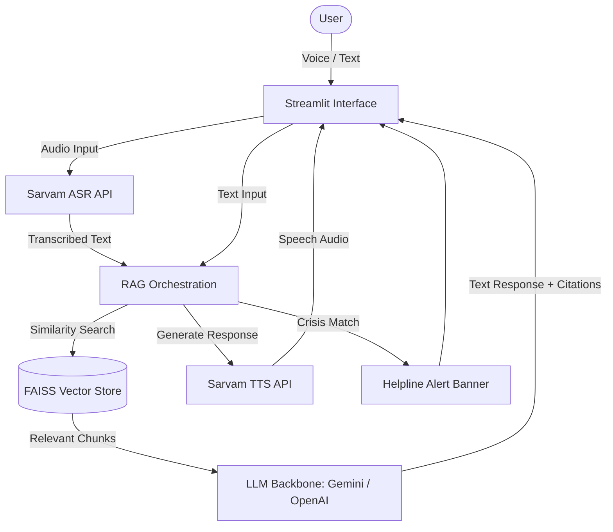

# 🧠 MitraMind — Multilingual Mental Health Support Chatbot

MitraMind is a production-grade, empathetic multilingual mental health support chatbot. It answers user questions by querying a curated, regional-appropriate mental health database using **Retrieval-Augmented Generation (RAG)**, and features high-fidelity **voice input & output** in Indian regional languages (Hindi, Telugu, Tamil, and English) using the **Sarvam AI** platform.

The system features **active crisis monitoring**, automatically identifying expressions of self-harm or deep distress and immediately displaying national support hotlines.

---

## 🚀 Key Features

*   **RAG over Mental Health Guidelines**: Answers queries by pulling context from official documents (WHO Mental Health guidelines, NIMHANS stress guide, iCall scripts) via LangChain and a local FAISS vector store.
*   **Indian Regional Language Voice Support**: Speak and listen in **Hindi (हिन्दी)**, **Telugu (తెలుగు)**, and **Tamil (தமிழ்)** using Sarvam AI ASR (Speech-to-Text) and TTS (Text-to-Speech) APIs.
*   **Empathetic Crisis Grounding**: Actively monitors conversational patterns for emergency keywords and displays crisis hotline banners with active telephone links.
*   **Premium Glassmorphic Interface**: Custom dark-mode UI styled via CSS containing smooth entrance animations, chat bubbles, and seamless browser-level audio recording.

---

## 🛠️ Architecture Flow



---

## ⚙️ Project Setup

### 1. Clone the repository
Ensure you are in the workspace folder:
```bash
cd MitraMind
```

### 2. Configure Environment Variables
Copy the `.env.example` file to `.env`:
```bash
cp .env.example .env
```
Open `.env` and configure your API keys:
- **`GOOGLE_API_KEY`**: Obtain from Google AI Studio. Used for embedding and generating conversational responses (Gemini-2.5-Flash).
- **`SARVAM_API_KEY`**: Obtain from the Sarvam AI Dashboard. Used for regional language Speech-to-Text (`saaras:v3`) and Text-to-Speech (`bulbul:v3`).

### 3. Install Dependencies
It is recommended to run this inside a virtual environment:
```bash
python -m venv venv
venv\Scripts\activate   # On Windows
source venv/bin/activate # On Unix/macOS

pip install -r requirements.txt
```

### 4. Build the RAG Knowledge Index
Ingest and split the knowledge base documents (`data/knowledge_base/*.txt`) to create the FAISS database directory:
```bash
python data/ingest_docs.py
```

### 5. Launch the Web Application
Start the Streamlit dashboard:
```bash
streamlit run app.py
```

---

## 🧑‍💻 Technical Details

| Component | Technology | Description |
|---|---|---|
| **Frontend UI** | Streamlit + Custom CSS | Glassmorphism, styled bubbles, custom badges, browser recording |
| **ASR & TTS** | Sarvam AI REST API | `saaras:v3` for speech transcription, `bulbul:v3` for voice playback |
| **Vector DB** | FAISS | High-speed offline similarity indexing of text chunks |
| **LLM Orchestrator**| LangChain | Query rephrasing, chat history parsing, and system prompting |
| **LLM Model** | Gemini 2.5 Flash / OpenAI | Empathetic chat responses, regional translation, citations formatting |
| **Crisis Filter** | Regex Monitor | Intercepts crisis keywords to render immediate helpline cards |

---

## 💡 Demo Prompts to Try

1. **Stress Coping**: *"I am feeling extremely stressed about my exams. What should I do?"* (Will retrieve breathing instructions from the NIMHANS Guide).
2. **Support Protocol**: *"How should I support a friend who is feeling depressed?"* (Will retrieve active listening protocols from the iCall FAQ).
3. **Crisis Trigger**: *"I don't want to live anymore, everything is going wrong."* (Triggers the red alert helpline card).
4. **Multilingual Test**: Switch the language to **Hindi (हिन्दी)** and record yourself asking: *"मुझे बहुत चिंता हो रही है।"* (Mitra will respond in Hindi and synthesise audio feedback).
